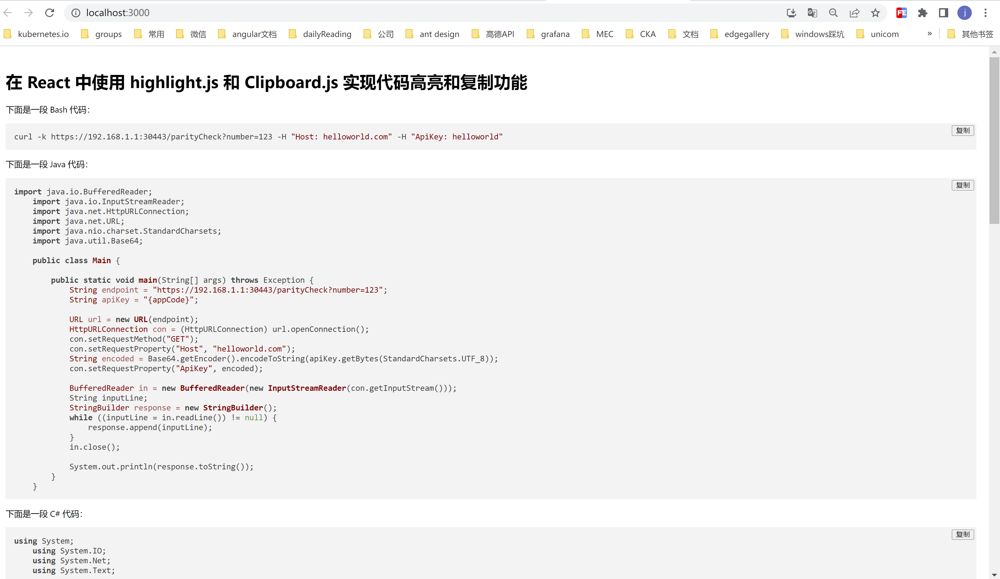

# 项目运行

## node版本

- node: v16.16.0

## 安装依赖

```shell
npm install
```

## 启动

```shell
npm start
```

# 在 React 中使用 highlight.js 和 Clipboard.js 实现代码高亮和复制功能

在网页开发中，代码高亮和复制功能是十分常见的需求。为了让界面更加美观，我们通常会使用一些成熟的库来实现这些功能，避免自己手写复杂的代码。而在 React 中，常用的代码高亮库是 [highlight.js](https://highlightjs.org/ "highlight.js")，常用的复制库是 [Clipboard.js](https://clipboardjs.com/ "Clipboard.js")。本篇文章将介绍如何在 React 中使用这两个库，实现代码高亮和复制功能。

## 安装 highlight.js 和 Clipboard.js

首先，在我们的 React 项目中安装 highlight.js 和 Clipboard.js：

```shell
npm install highlight.js clipboard --save
```

安装完成后，我们就可以在 React 中使用这两个库了。

## 配置 highlight.js 支持的语言

highlight.js 支持很多种语言的代码高亮，我们需要配置支持的语言。在本例中，我们只演示部分语言的高亮，可根据自己的需要进行配置。我们创建一个 `src/highlight.js` 文件：

```javascript
import hljs from 'highlight.js/lib/core';
// 导入需要的语言高亮
import java from 'highlight.js/lib/languages/java';
import csharp from 'highlight.js/lib/languages/csharp';
import php from 'highlight.js/lib/languages/php';
import python from 'highlight.js/lib/languages/python';
import objectivec from 'highlight.js/lib/languages/objectivec';
import bash from 'highlight.js/lib/languages/bash';

hljs.registerLanguage('java', java);
hljs.registerLanguage('csharp', csharp);
hljs.registerLanguage('php', php);
hljs.registerLanguage('python', python);
hljs.registerLanguage('objectivec', objectivec);
hljs.registerLanguage('bash', bash);

export default hljs;
```

在这个文件中，我们导入了需要使用的语言高亮，并注册到了 highlight.js 中，最后导出了 `hljs` 对象。这样，我们就可以在 React 中方便地使用 highlight.js 了。

## 创建 CodeBlock 组件

我们创建一个 `src/components/CodeBlock/index.js` 文件，实现 `CodeBlock` 组件：

```javascript
import React, { useEffect, useRef, useState } from 'react';
import hljs from '../../highlight';
import Clipboard from 'clipboard';

import 'highlight.js/styles/default.css';

export default function CodeBlock({ language, code }) {
  const preRef = useRef(null);
  const [copied, setCopied] = useState(false);

  useEffect(() => {
    if (preRef.current) {
      hljs.highlightBlock(preRef.current);

      // 创建 clipboard 实例并保存到变量中
      const clipboard = new Clipboard(`#${language}copy_btn`, {
        text: () => code,
      });

      // 监听复制成功事件
      clipboard.on('success', () => {
        setCopied(true);
        setTimeout(() => setCopied(false), 2000);
      });

      // 销毁 clipboard 实例
      return () => {
        clipboard.destroy();
      };
    }
  }, [code]);

  return (
    <div className="code-block" style={{ position: 'relative', marginTop: 8 }}>
      <pre>
        <code id={language} ref={preRef} className={language}>
          {code}
        </code>
      </pre>
      <button id={`${language}copy_btn`} style={{ position: 'absolute', top: 4, right: 4, lineHeight: '14px' }} className="code-block__button" data-clipboard-target={`#${language}`} disabled={!preRef.current}>
        {copied ? '已复制' : '复制'}
      </button>
    </div>
  );
}
```

在这个组件中，我们使用了 `useRef` 和 `useEffect` 钩子，分别保存了代码块的 DOM 对象和复制按钮的 Clipboard 对象。在 `useEffect` 中，我们使用 highlight.js 对代码块进行了高亮，并创建了 Clipboard 实例，监听了复制成功事件。当点击复制按钮后，会将代码块的内容复制到剪贴板中，并在按钮上显示“已复制”，2 秒后消失。最后，我们将代码块和复制按钮显示在了页面上。

## 使用 CodeBlock 组件

```javascript
import React from 'react';
import CodeBlock from '../components/CodeBlock';

export default function BlogPost() {
  const code = `
    public static void main(String[] args) {
      System.out.println("Hello, World!");
    }
  `;

  return (
    <div>
      <h1>这是一篇博客文章</h1>
      <p>下面是一段 Java 代码：</p>
      <CodeBlock language="java" code={code} />
    </div>
  );
}
```

## 效果展示


